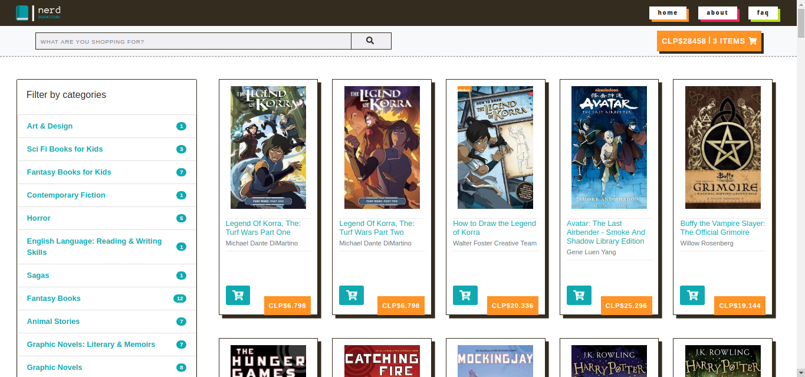
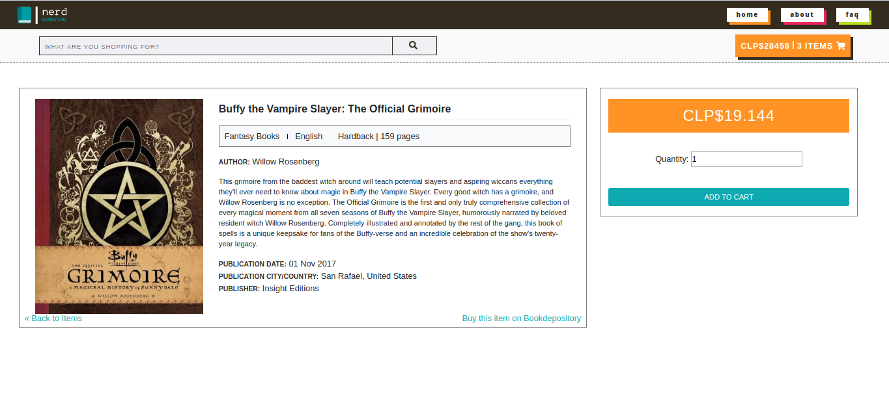
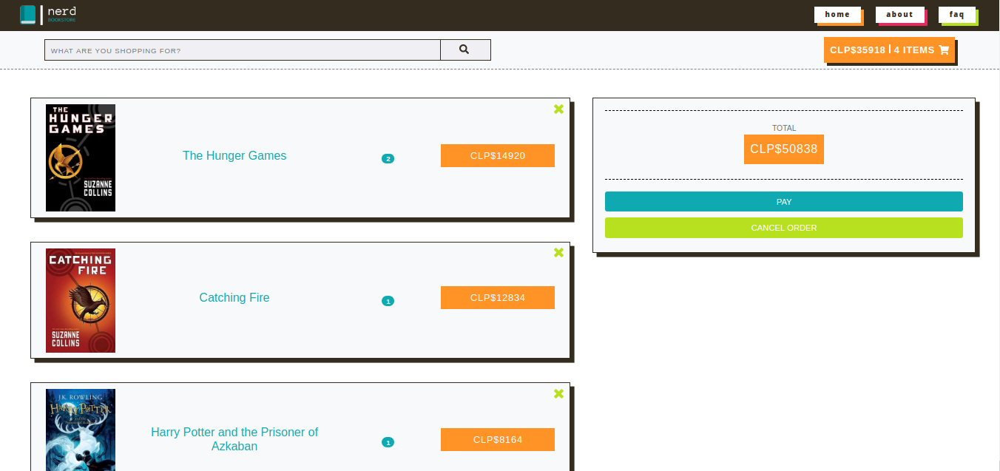
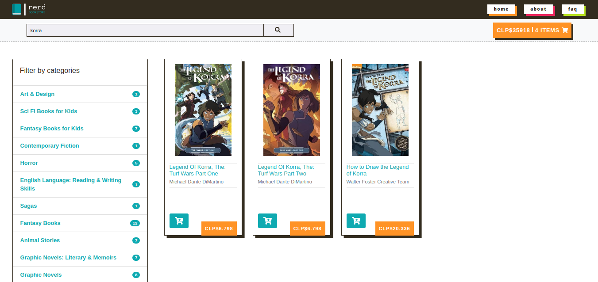

# Nerd Bookstore
**Nerd Bookstore** es el demo de una tienda online de venta de libros, cómics y mangas, cuyo sitio web es una Single Page Application (SPA).

## Desarrollo
Para crear Nerd Bookstore partimos por utilizar un web scraper hecho por nosotras para recopilar los datos desde Book Depository (puedes verlo [aquí](https://github.com/malditoprotozoo/bookScrape)).

Nuestro proyecto cuenta con cuatro vistas diferentes y para desarrollarlas utilizamos la librería [Sammy JS](http://sammyjs.org/) y su plugin para el uso de templates.

Para almacenar la información de compra utilizamos Local Storage a través de un plugin del mencionado Sammy.

## Templates

* La vista inicial corresponde a todos los items disponibles:

* Al hacer click en un producto se pueden ver más detalles sobre el mismo y además se entrega la opción de comprarlo en Book Depository:

* El carro de compras es otra vista. En él se pueden encontrar todos los productos que han sido agregados, con su título correspondiente, la cantidad y el precio total.

* Para las búsquedas desarrollamos otro template, similar a la vista inicial, con la diferencia de que sólo muestra los items que se corresponden con la búsqueda:

## Desarrolladoras
* Leticia Ferreira /helvette/
* Victoria Tori Rodríguez /malditoprotozoo/